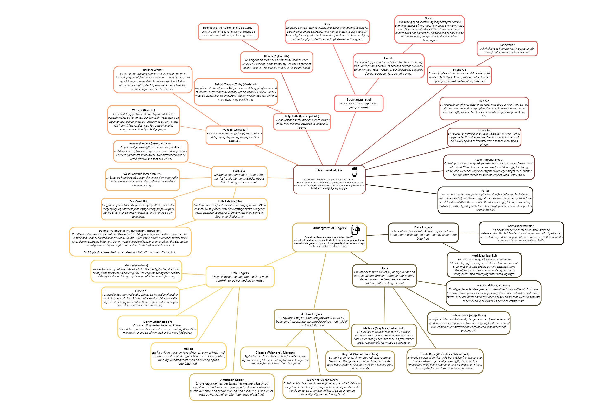

# Jonas' Opskriftssamling

Velkommen til min samling af opskrifter! Her finder du alt fra lækre hovedretter til tilbehør, desserter og drikkevarer. Brug menuen nedenfor til at udforske de forskellige kategorier.

---

## 🍞 Brød
- [Pizza](opskrifter/brød/pizza.md)

## 🐓 Kylling
- [Kylling Fricassee](opskrifter/kylling/kylling-fricassee.md)
- [Kylling Fajitas](opskrifter/kylling/kylling-fajitas.md)
- [Kylling i Paprikasauce](opskrifter/kylling/kylling-i-paprikasauce.md)
- [Kylling Kebab](opskrifter/kylling/kylling-kebab.md)
- [Kylling Piccata](opskrifter/kylling/kylling-piccata.md)

## 🥩 Oksekød
- [Shish Kebab](opskrifter/oksekød/shish-kebab.md)
- [Chutneyglaseret Oksekød](opskrifter/oksekød/chutneyglaseret-oksekød.md)
- [Spaghetti Bolognese](opskrifter/oksekød/spaghetti-bolognese.md)
- [One-pot Mexicansk Pasta](opskrifter/oksekød/one-pot-mexicansk-pasta-med-oksekød-og-cheddar.md)
- [Stir Fry med Grønne Bønner](opskrifter/oksekød/stir-fry-med-grønne-bønner.md)

## 🥗 Salater
- [Mango Salsa](opskrifter/salat/mango-salsa.md)
- [Kikærtesalat med Feta](opskrifter/salat/kikærtesalat-med-feta-og-krydret-marinade.md)

## 🥘 Tilbehør
- [Perlebyg](opskrifter/tilbehør/perlebyg.md)
- [Ovnristede Grøntsager](opskrifter/tilbehør/ovn-ristet-grøntsager.md)
- [Selleri Puré](opskrifter/tilbehør/selleri-pure.md)
- [Rösti](opskrifter/tilbehør/rösti.md)

## 🥤 Safter og Drikke
- [Lemonade](opskrifter/safter/lemonade.md)
- [Æblecider](opskrifter/safter/æblecider.md)

## 🥫 Sylt
- [Syltet Rødkål](opskrifter/sylt/syltet-rødkål.md)
- [Syltet Banan Chili](opskrifter/sylt/syltet-banan-chili.md)
- [Æblecidereddike](opskrifter/sylt/æblecidereddike.md)

## 🥣 Dressing og Sauce
- [Chili Olie](opskrifter/dressing-og-sauce/chili-olie.md)
- [Baba Ganoush](opskrifter/dressing-og-sauce/baba-ganoush.md)
- [Bordelaise Sauce](opskrifter/dressing-og-sauce/bordelaise-sauce.md)

---

## 🌟 Inspiration hos Andre
- [Life By Mike G](https://lifebymikeg.com/)
- [Martinys Blog](https://martinys.dk/verdenskoekken/mellemoestlig/)

---

