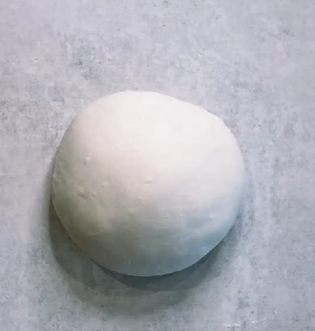
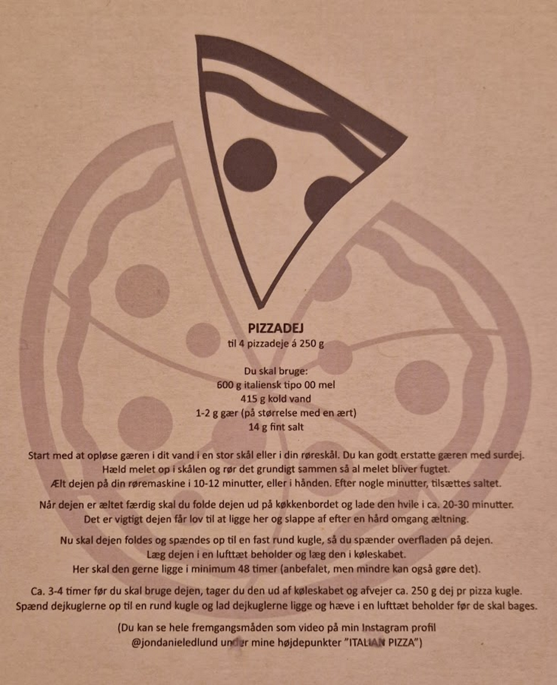

# Pizza

<figure markdown="span">
  { width="500" }
  <figcaption></figcaption>
</figure>

## 📝 Introduktion
---

Opskriften på denne dej kommer fra dengang jeg var på pizzakursus hos Jon fra Den Store Bagedyst.

## 🛒 Ingredienser
---

### Pizzadej til 4 pizzadeje á 250g 
- 600 g italiensk tipo 00 mel
- 415 g koldt vand
- 1-2 g gær (eller 0,5 tsk. tørgær eller 80g aktiv surdej)
- 14g fint salt

## 👩‍🍳 Fremgangsmåde
---

1. **Forbered dejen (dagen før)**
    - Start med at opløse gæren i dit vand i en stor skål eller i din røreskål. Du kan godt erstatte gæren med surdej.
    - Hæld melet op i skålen og rør det grundigt sammen så al melet bliver fugtet.
    - Ælt dejen på din røremaskine i 10-14 minutter, eller i hånden. Efter 7-8 minutter tilsættes saltet, hvorefter den får de sidste 5-6minutter
    - Når dejen er æltet færdig skal du folde dejen ud på køkkenbordet og lade den hvile i ca. 20-30 minutter. Det er vigtigt dejen får lov til at ligge her og slappe af efter en hård omgang æltning.
    - Nu skal dejen foldes og spændes op til en fast rund kugle, så du spænder overfladen på dejen.
    - Læg dejen i en lufttæt beholder og læg den i køleskabet.
    - Her skal den gerne ligge i minimum 48 timer (anbefalet, men mindre også gøre det)
    - Læg mærke til at an på hvilken mel der bliver brugt, kan den udvikle smag i op til 6 dage.

<figure markdown="span">
  { width="200" }
  <figcaption>Fold dejen som en fast rund kugle</figcaption>
</figure>

2. **Klargøring af dejen**
    - Ca. 3-4 timer før du skal bruge dejen, tager du den ud af køleskabet og afvejer ca. 250g dej pr. pizza kugle.
    - Spænd dejkuglerne op til en rund kugle og lad dejkuglerne ligge og hæve i en lufttæt beholder før de skal bages.
   
<figure markdown="span">
  { width="500" }
  <figcaption>Opskrift på pizzadej fra Jon</figcaption>
</figure>

## 📚 Kilder & Inspiration
---

!!! info "Lignende opskrifter og inspiration"
    - [Køb ind til rigtig pizza hos Pizzafredag](https://pizzafredag.dk/produkter/)

