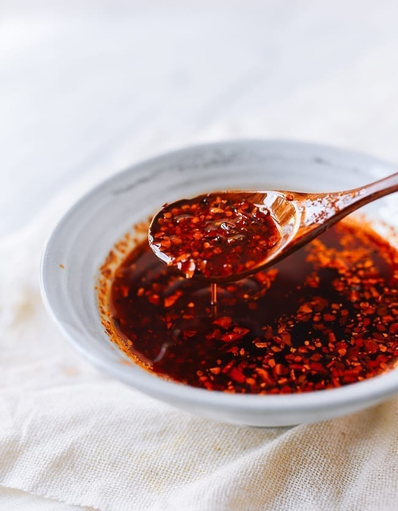

---
tags:
   - kinesisk
---

# Chili Olie

## Ingredienser
- 350-700 ml neutral olie
- 5 stjerneanis
- 1 kanelstang (helst cassia kanel)
- 2 laurbærblade
- 3 spsk. Sichuan peberkorn
- 2 sorte kardemommekapsler (valgfrit)
- 1 spsk. tørret sand ingefær (valgfrit)
- 2 tsk. nelliker (valgfrit)
- 3 fed hvidløg (valgfrit – knust)
- 1-2 skalotteløg (valgfrit – halveret)
- 65-110 g Sichuan chiliflager
- 1-2 tsk. salt (efter smag)

## Sådan gør du

1. Forbered ingredienserne:
    - Saml alle de aromatiske ingredienser, du planlægger at bruge. Placer olie og de valgte aromater i en gryde med mindst fem centimeter fri plads mellem olien og kanten af gryden.
2. Opvarm olien:
    - Varm olien langsomt op over medium varme, indtil den når en temperatur på ca. 120°C. Hold øje med olien og sørg for, at den ikke bliver for varm.
3. Tilsæt krydderierne:
    - Når olien er varm, tilsæt stjerneanis, kanelstang, laurbærblade, Sichuan peberkorn, sorte kardemommekapsler, sand ingefær, nelliker, hvidløg og skalotteløg. Lad krydderierne simre i olien i ca. 30 minutter, indtil de er sprøde og aromatiske.
4. Si olien:
   - Fjern gryden fra varmen og lad olien køle af i ca. 5 minutter. Si olien gennem en finmasket si for at fjerne krydderierne.
5. Tilsæt chiliflager:
    - Placer Sichuan chiliflagerne i en varmebestandig skål. Hæld den varme olie over chiliflagerne og rør godt rundt. Tilsæt salt efter smag.
6. Opbevaring:
    - Lad chiliolien køle helt af, før den hældes på en ren glasbeholder. Opbevar chiliolien i køleskabet i op til 1 måned.

## Tips

- For en mildere olie, brug færre chiliflager eller fjern frøene fra chilierne.
- Du kan tilføje lidt sukker for en sødere smag.

## Servering

Server din chiliolie med:
- Dumplings
- Noodles
- Stir-fry retter
- Som dip til brød

!!! info "Lignende opskrifter"
    - [The Woks of Life - Homemade Chili Oil](https://thewoksoflife.com/chinese-chili-oil/)
