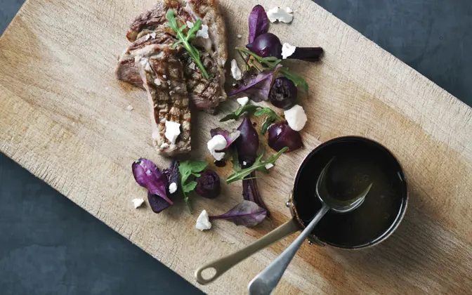

# Koteletter og små sommerkartofler på grill med en vandmalonssalat og kold dressing

<figure markdown="span">
  { width="500" }
  <figcaption>Grillet kortelletter med sommer kartofler</figcaption>
</figure>

## 🛒 Ingredienser
---

### Svinemørbrad
- 400 g koteletter
- 0,5 spsk olivenolie
- 0,5 spsk sesamolie
- 2 friske rosmarinkviste
- 0,5 tsk groft salt
- Friskkværnet peber

### Kartofler på grill
- 800 g små kartofler (gerne nye)
- 3 dl kogende vand
- 3 spsk. olivenolie
- 40 g smør
- 2 fed hvidløg pressede
- 1 spsk. frisk rosmarin finthakket
- 1 tsk flagesalt
- Friskkværnet peber

### Vandmalonssalat
- 30 g pinjekerner
- 50 g rucola eller babyspinat
- o,25 vandmalon (tilpas ift. størrelse)
- 100 g feta

### Creme fraiche dressing med purløg
- 2,5 dl creme fraiche
- Én håndfuld frisk finthakket purløg
- 1 tsk dijonsennep
- 0,5 tsk groft salt
- friskkværnet peber

## 👩‍🍳 Fremgangsmåde
---

### Prep et par timer før tilberedning
1. Mariner koteletter 
   1. Mariner koteletter med olie, rosmarin og peber
   2. Stil kødet tildækket tilbage i køleskabbet i **et par timer**

### Tilberedning

1. **Grill kartofler**
   1. Tænd grillen
   2. Skrub og skul kartoflerne og halver evt. de største.
   3. Læg kartoflerne i en foliebakke og hæld kogende vand over så irka 0,5 cm. af kartoflerne er dækkt med vand.
   4. Dæk bakken med alufolie og still den på en varm grill ved direkte varme i 15-20 minutter eller til at kartoflerne er møre.
   5. Fjern alufolien fra grillen og hæld oveskydende vand fra.
   6. Rør olie, smør hvidløg, rosmarin, salt og peber sammen og fordel blnadingen over kartoflerne.
   7. Stil foliebakken tilbage på grillen (uden alufolie over) og grill kartoflerne i 10 minutter til de er gyldne og sprøde. Vend dem eventuelt undervejs.
   8. Top med friske krydderurter og flagesalt inden servering
2. **Grill koteletter**
   1. krydr kødet med salt og grill korteletterne over meget høj varme
   2. Grill dem cirka 2-3 minutter på hver side
   3. **Bonus:**
      1. Tag koteletterne af grillen og lad dem hvilek i 10 minutter. Inden servering varm koteletterne på en pande i varmt smør.
3. **Lav creme fraiche dressing**
   1. Bland cremefraiche med de øvrige ingredienser og smag til.
4. **Lav vandmalonssalat**
   1. Kom pinjekerner på en tør pande og rist dem til de er gyldne. Hold godt øje med dem. Tag dem af panden og lad dem køle af.
   2. Fordel rucola eller babyspinat på et pænt fad eller stor tallerken.
   3. Skær din vandmelon i små tern og kom den ovenpå salaten.
   4. Smuldr feta over vandmelonen.
   5. Fordel de afkølede pinjekerner øverst på din vandmelonsalat.

 

## 📚 Kilder & Inspiration
---

!!! info "Lignende opskrifter og inspiration"
    - [Koteller på grill](https://www.danishcrown.com/da-dk/opskrifter/kalvekotelet-med-roedbeder-paa-grill/)
    - [Kartofler på grill](https://www.danishcrown.com/da-dk/opskrifter/kartofler-paa-grill/)
    - [Vandmalonssalat med feta](https://www.louisesmadblog.dk/vandmelonsalat-med-feta/)
    - [Creme fraiche dressing med purløg](https://www.arla.dk/opskrifter/cremefraichedressing-med-purlog/)

