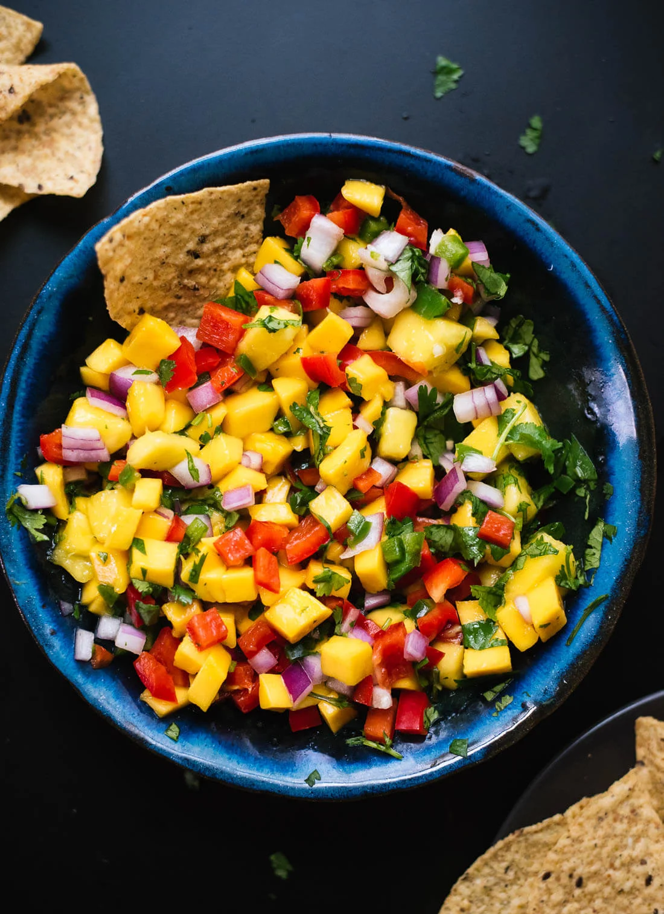
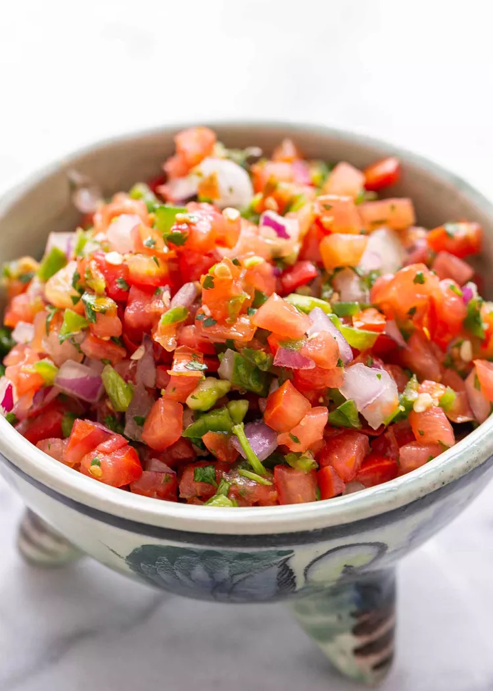

# Carnitas

<figure markdown="span">
  { width="350" }
  <figcaption>En lækker mexikansk simreret der er super simpel</figcaption>
</figure>

## 📝 Introduktion
---

En populær mexicansk simmerret med svinekød går under navnet "Carnitas". Denne ret er llavet af langsomt kogt svinekød, som får lov til at simre indtil det er mørkt og falder fra hinanden. Traditionelt tilberedes carnitas i en stor jerngryde, der kaldes en "cazuela", og den kan tilberedes med en lang række krydderier og smagsgivere.

## 🥗 Varianter
---

- Buritos m. carnitas, flæskesværd, pico de gallo, guacamole og habanero salsa.
- Soft tacos m. carnitas, mango salsa og guacamole.

## 🛒 Ingredienser
---

### Carnitas

- 2 kg nakkefilet (eller andet styk svinekød)
- 2 løg
- 1 hoved hvidløg
- 2 appelsiner (skal + saft)
- 1 spsk. spidskommen
- 1 spsk. oregano
- 2 tsk. salt
- 1 tsk. sort peber
- evt. et par tørret chilies

### Mango salsa
- 1 modne mango, fint skåret
- 0,5 mellemstor rød peberfrugt, hakket
- 0,33 mellemt rødt løg, fint hakket
- En stor håndfuld friske korianderblade, hakket
- 1 jalapeño, uden frø og finthakket
- Saften fra 1 stor lime
- Knivspids salt 

<figure markdown="span">
  { width="250" }
</figure>

### Pico de Gallo

- 4 mellemstore tomater, hakket
- 0,5 mellemstor løg, finthakket
- 1-2 jalapeño chilier, frø fjernet og finthakket
- En stor håndfuld frisk koriander, hakket
- 2 spsk. frisk limesaft
- Salt og peber efter smag

<figure markdown="span">
  { width="250" }
</figure>

## 👩‍🍳 Fremgangsmåde
---

1. **Simre kød**
    - Skær nakkefileten i nogle store stykker
    - Skær løg i store både og pil hvidløg
    - Varm en stor gryde over medium varme
    - Tilsæt nakkesteg og steg det indtil det brunet på alle sider.
    - Tilsæt løg, hvidløg, appelsinskal, appelsinsaft, spidskommen, oregano, salt og peber (evt. tørret chili)
    - Tilsæt vand, indtil det lige akkurat dækker kødet
    - Lad det dernæst simret ved lav varme i 3-4 timer, indtil kødet er mørt og falder fra hinanden

2. **Færdiggør kødet**
    - Fjern dernæst kødet fra gryden og skru op for varmen
    - Lad saucen koge ind, indtil den bliver tyk og sirupagtig
    - Riv kødet fra hinanden og tilsæt det tilbage til gryden og vend det i saucen

3. **Mango Salsa**
    - I en serveringsskål kombiner mango, peberfrugt, løg, koriander og jalapeño.
    - Ved det rundt med en smule limesaft og en drys salt.

4. **Pico de Gallo**
    - I en serverinsskål tilføj tomat, løg, jalapeño og koriander.
    - Ved det rundt med en smule limesaft, salt og peber.

## Referencer

!!! info "Lignende opskrifter"
    - [Frisk mango salsa opskrift](https://cookieandkate.com/fresh-mango-salsa-recipe/)
    - [Simply Recipes - Pico de Gallo](https://www.simplyrecipes.com/recipes/fresh_tomato_salsa/)
