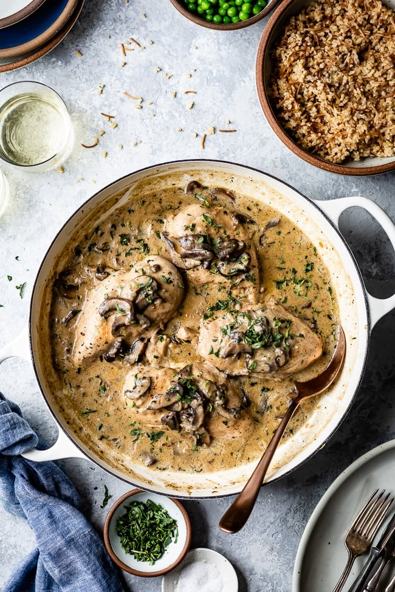

---
tags:
   - fransk
---

# Kylling Fricassee

## Ingredienser (4 personer)
- 900 g kyllingebryst uden ben og skind
- 1 tsk kosher salt
- 1/2 tsk sort peber
- 1 spsk smør
- 1 spsk olivenolie
- 1 løg, finthakket
- 450 g Portobello svampe, renset, trimmet og skåret i skiver
- 60 ml tør hvidvin, såsom Sauvignon blanc
- 1 spsk hvedemel
- 2 fed hvidløg, hakket
- 360 ml kyllingebouillon

### Sauce
- 80 ml creme fraiche
- 1 æggeblomme
- 1/2 tsk friskrevet muskatnød
- 2 tsk friskpresset citronsaft
- 2 tsk hakket estragon (eller persille, hvis estragon ikke er tilgængelig)

## Sådan gør du

1. Forbered kyllingen:
    - Dup kyllingebrysterne tørre med køkkenrulle og krydr dem generøst med 1 tsk salt og 1/2 tsk sort peber.
    - Varm smør og olivenolie i en stor stegepande over medium høj varme. Læg kyllingebrysterne i panden og steg dem i 4 minutter på hver side. De vil ikke være gennemstegte på dette tidspunkt.
    - Tag kyllingebrysterne af panden, læg dem på en tallerken og dæk dem med aluminiumsfolie. Sæt til side.
2. Tilbered grøntsagerne:
    - Tilsæt svampe, løg og hvidvin til samme pande og steg i 8-10 minutter, rør lejlighedsvis, indtil svampene er brunede.
    - Tilsæt hvidløg og mel og rør godt rundt. Steg i 1 minut.
    - Tilsæt kyllingebouillon og skrab bunden af panden for at løsne de brune stykker. Kog indtil bouillonen koger.
3. Kog kyllingen:
    - Læg kyllingebrysterne og alle safterne fra tallerkenen tilbage i panden og dæk med låg. Kog ved medium varme, indtil kyllingen når en indre temperatur på 71°C målt med et termometer i midten. Dette tager 5 til 10 minutter.
4. Forbered saucen:
    - I mellemtiden, pisk æggeblommen og creme fraiche sammen i en lille skål.
    - Tag kyllingebrysterne ud af panden og læg dem på et fad. Dæk dem med aluminiumsfolie og sæt til side.
    - Mål 120 ml af svampesaucen og rør det i creme fraiche og æggeblommeblandingen. Bland godt.
    - Under konstant omrøring, hæld langsomt blandingen tilbage i panden. Tilsæt citronsaft, estragon og muskatnød. Lad det simre i 5 minutter.
    - Smag til med salt og peber efter behov.
5. Servering:
    - For at servere, læg et kyllingebryst på en tallerken og hæld saucen over det. Drys med mere estragon, hvis ønsket.

## 🥗 Serveringsforslag
---

Server med:
- [Perlebyg](../tilbehør/perlebyg.md)

## 📚 Kilder & Inspiration
---

!!! info "Lignende opskrifter"
    - [FoolProofLiving - Chicken Fricassee](https://foolproofliving.com/chicken-fricassee/)
