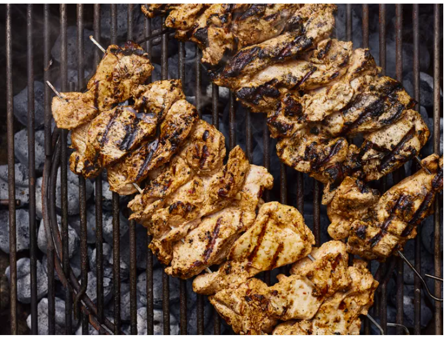

---
tags:
   - tyrkisk
---

# Kylling-kebab

## Ingredienser (4 personer)

**Forberedelsestid:** 15 min  
**Tilberedningstid:** 15 min  
**Ekstra tid:** 2 timer  
**Samlet tid:** 2 timer 30 min

- 200 g græsk yoghurt
- 6 fed hvidløg
- 2 spsk. olivenolie
- 2 spsk. friskpresset citronsaft, eller mere efter smag
- 2 spsk. ketchup
- 1 spsk. chiliflager
- 1 spsk. salt
- 1 ½ tsk. stødt spidskommen
- 1 tsk. friskkværnet sort peber
- 1 tsk. paprika
- ⅛ tsk. stødt kanel
- 1 kg kylling (kyllingelår, kyllingebryst)

## Sådan gør du

1. Pisk yoghurt, hvidløg, olivenolie, citronsaft, ketchup, røde peberflager, salt, spidskommen, sort peber, paprika og kanel sammen i en stor skål.
2. Læg kyllingelårhalvdelene i yoghurtmarinaden og dæk dem grundigt på alle sider. Dæk skålen med plastfolie og stil den i køleskabet i 2 til 8 timer.
3. Forvarm en udendørs grill til medium-høj varme og smør risten let med olie.
4. Brug 2 spyd til hver kebab, og træk halvdelen af kyllingelårene på hvert par spyd, så de danner en ret tyk "log" form.
5. Læg kebaberne på den forvarmede grill. Forsøg ikke at vende dem, før de begynder at slippe fra grillen, 3 til 4 minutter. Vend kebaberne og grill den anden side i 3 til 4 minutter. Fortsæt med at tilberede og vende, indtil kyllingen ikke længere er lyserød i midten, cirka 6 minutter mere. Et øjeblikkeligt aflæst termometer indsat i midten skal vise mindst 74 grader C.
6. Server varm.

## Inspiration til aftensmad

- Kyllingewraps med bagt blomkål og løgsalat.

!!! info "Lignende opskrifter"
    - [Allrecipes - Tyrkisk kyllinge kebab](https://www.allrecipes.com/recipe/244632/turkish-chicken-kebabs/)
