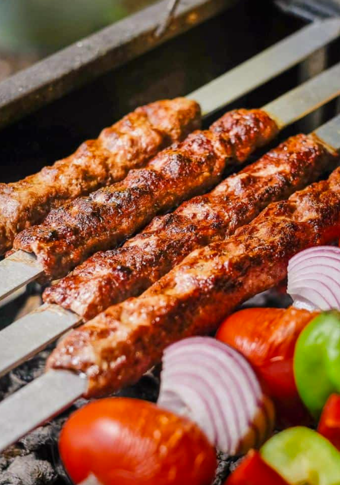

---
tags:
   - tyrkisk
---

# Shish Kebab

## Ingredienser (4 personer)
- 500 g hakket oksekød (eller lammekød, hvis du foretrækker det)
- 1 lille løg, revet eller finthakket
- 2 fed hvidløg, presset
- 1 tsk stødt spidskommen
- 1 tsk stødt koriander
- 1 tsk røget paprika
- 1/2 tsk chiliflager (valgfrit for ekstra varme)
- 1/2 tsk kanel (valgfrit for en mellemøstlig nuance)
- 2 spsk hakket persille
- 2 spsk olivenolie
- 1 tsk salt
- 1/2 tsk sort peber

## Sådan gør du

1. Forbered farsen:
   - I en stor skål blandes hakket kød, revet løg, hvidløg, spidskommen, koriander, paprika, chiliflager, kanel, hakket persille, salt og peber.
   - Tilsæt olivenolie, og ælt farsen godt sammen, så krydderierne bliver jævnt fordelt.
   - Lad farsen hvile i køleskabet i ca. 30 minutter, så smagene kan udvikle sig.
2. Form kebabberne:
   - Tag en lille håndfuld fars og form den omkring spyd (træspyd skal være gennemvædet i vand i ca. 30 minutter, hvis du bruger dem i ovnen). Lav aflange, jævne kebabpølser.
   - Hvis du ikke har spyd, kan du forme små aflange "frikadeller".
3. Forbered ovnen:
   - Forvarm ovnen til 220°C (over- og undervarme).
   - Beklæd en bageplade med bagepapir eller smør den let med olie.
4. Bag kebabberne:
   - Placer kebabberne på bagepladen, og bag dem i ovnen i ca. 15-20 minutter, vend dem halvvejs igennem. De skal være gyldne og gennemstegte.
5. Grill for ekstra smag (valgfrit):
   - For at få en lidt grillet overflade kan du tænde ovnens grillfunktion de sidste 2-3 minutter. Hold øje, så de ikke brænder.

## Tips
- Du kan tilføje små stykker grøntsager (f.eks. peberfrugt eller løg) på spydene mellem kødet for ekstra farve og smag.

## Servering
Server dine ovnbagte shish kebab med:
- Fladbrød eller pita
- Hummus, tzatziki, baba ganoush, yoghurt dressing
- Grøn salat eller tabbouleh
- Grillede grøntsager (f.eks. peberfrugt, squash eller aubergine)
- Syltede grøntsager (f.eks. syltede rødløg eller agurker)

!!! info "Lignende opskrifter"
    - [TheDeliciousCrescent - Kabob koobideh minced meat kebab](https://www.thedeliciouscrescent.com/kabob-koobideh-minced-meat-kebab/)