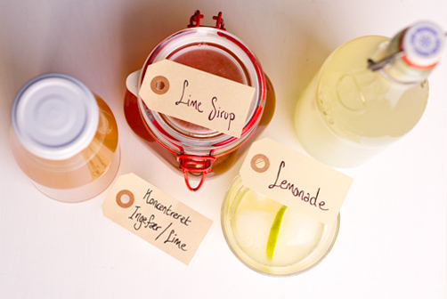

# Ingefærs øl

<figure markdown="span">
  { width="500" }
  <figcaption>Ingefærs ølr</figcaption>
</figure>

## Ingredienser
- 75 g ingefær (økologisk)
- Cirka 150 g sukker(økologisk)
- Cirka 3 l vand

### Ingefærstarter:

- Skyl og riv 25 g ingefær ned i et lille patentglas
- Tilsæt 1 dl vand og spsk. sukker. Luk glasset evt. med en elasatik om patentlåsen i stedet for at lukke helt tæt, og lad det stå ved stuetemperatur.
- Tilsæt 1 tsk. sukker og 1 spsk. vand hver dag, indtil blandingen betynder at boble. Det tager cirka 3 dage. Når ingefærstarteren er begyndt at boble, så er din starterkultur klar til at benyttes til produktion af ginger beer.

### Ginger Beer:

- Skyl og riv 50 g ingefær med skræl ned i en gryde der kan rumme minimum 2L og tilsæt 1,5 L vand.

- Bring blandingen i kog, skru ned for blusset og lad det simre i 20 minutter, for at trække smag ud af ingefæren. Tag gryden af blusset, og hæld ingefærvæsken gennem en si over i en skål.

- Tilsæt 125 g sukker til den varme væske og rør rundt indtil sukkeret er opløst. Tilsæt derefter 1,5 l koldt vand og bland væsken rundt, så den afkøles.

- Når blandingen har fået stuetemperatur, hælder du den på et eller to store patentglas eller kondibøtter og tilsætter ingefærstarteren. Dæk åbningen på beholderen med et klæde eller et kaffefilter så der ikke kommer bananfluer i.

- Lad din ginger beer fermentere 2 til 3 dage ved stuetemperatur på et skyggefuldt sted. Er temperaturen varmere, kan det gå stærkere, er den koldere, kan det gå langsommere.

- Efter 2 til 3 dage begynder ginger beeren at boble. Når det sker, kan du prøve at smage på blandingen og fornemme, om den har en god balance mellem syre og sødme.

- Hæld væsken gennem en si og over på 4 patanetflasker. Lad flaskerne stå og karbonere ved stuetemperatur i 1 til 2 dage, og stil dem derefter på køl.

- Nu er der blevet dannet kulsyre og en smule alkohol i ginger beeren. Din ginger beer vil fortsætte med at danne kulsyre og alkohol i køleskabet, så det er bedst at drikke den inden for 2 uger, efter den er kommet på flaske. Det er vigtigt at du åbner flasken langsomt, når du skal smage på den, for du kan risikere at ginger beeren har overkarboneret og nærmest springer i luften, når du åbner.

## Ginger beer
___

<figure markdown="span">
<video width="" height="" controls>
  <source src="../../attachments/ginger-bug-01.mp4" type="video/mp4">
</video>
  <figcaption>Ginger bug</figcaption>
</figure>

<figure markdown="span">
<video width="" height="" controls>
  <source src="docs/attachments/ginger-beer-01.mp4" type="video/mp4">
</video>
  <figcaption>Ginger beer</figcaption>
</figure>

## Referencer

!!! info "Lignende opskrifter"
    - [Ginger beer](https://www.dr.dk/mad/opskrift/ginger-beer)