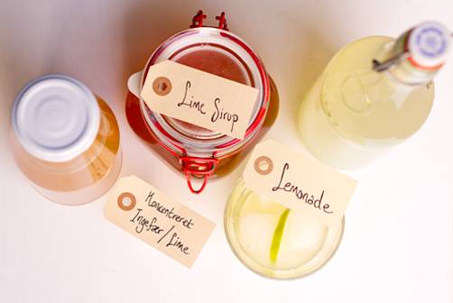

# Lemonade

<figure markdown="span">
  { width="500" }
  <figcaption>Lemonade</figcaption>
</figure>

## Limesirup:
### Ingredienser
- Saften fra 10 limefrugter
- 425 g sukker

### Sådan gør du
1. Saften fra 10 limefrugter hældes i en gryde sammen med 425 g sukker. Det er meget sukker, men sirup er jo stort set flydende sukker. Citrusfrugter indeholder meget pektin, hvilket gør dem meget egnet til syltning og til sirup.
2. Siruppen skal koge 20-25 min uden låg og under omrøring. En klassisk test for at se om siruppen er færdig er “gelétesten”, hvor et par dråber sirup dryppes på en tallerken og stilles koldt. Når det er kølet af, kan man lave en streg igennem dråben med en ske. Hvis dråben samles med det samme, er siruppen ikke helt klar. Hvis dråben derimod lader sig dele og ikke umiddelbart samles, er siruppen klar og kan hældes på glas (skyllet i atamon).
3. Testen kan godt foretages mens man er i gang. Vi tog i hvert fald bare gryden af mens vi testede og kogte så op igen, hvis den skulle have lidt mere. Vores lime var ikke økologiske, men havde de været det, ville vi helt klart også have tilsat lidt limeskal for at give det et ekstra pift. Et rigtig godt serveringsforslag er pandekager.

## Ingefær-Limesaft:
### Ingredienser
- Saften fra 10 limefrugter
- 425 g sukker
- 50 g revet ingefær

### Sådan gør du
1. Vi har tidligere lavet ingefær lime te, og denne opskrift minder meget om den. Her er det bare lavet som en koncentreret saft, der kan blandes op med kogende vand. Det er en nem måde at lave en stor portion på, som man kan have glæde af i et par dage.
2. Lime, revet ingefær og sukker koges i ca. 20 minutter. Herefter sigtes det og hældes på flaske (skyllet i atamon). Blandingsforholdet er 1:4 – 1:5, alt efter hvor stærk man vil have den, og man kan også altid tilsætte lidt mere sukker.

## Referencer

!!! info "Lignende opskrifter"
    - [Lemonade, limesirup og ingefær-limesaft](https://foodblogging.dk/lemonade-limesirup-og-ingefaer-limesaft/2160)