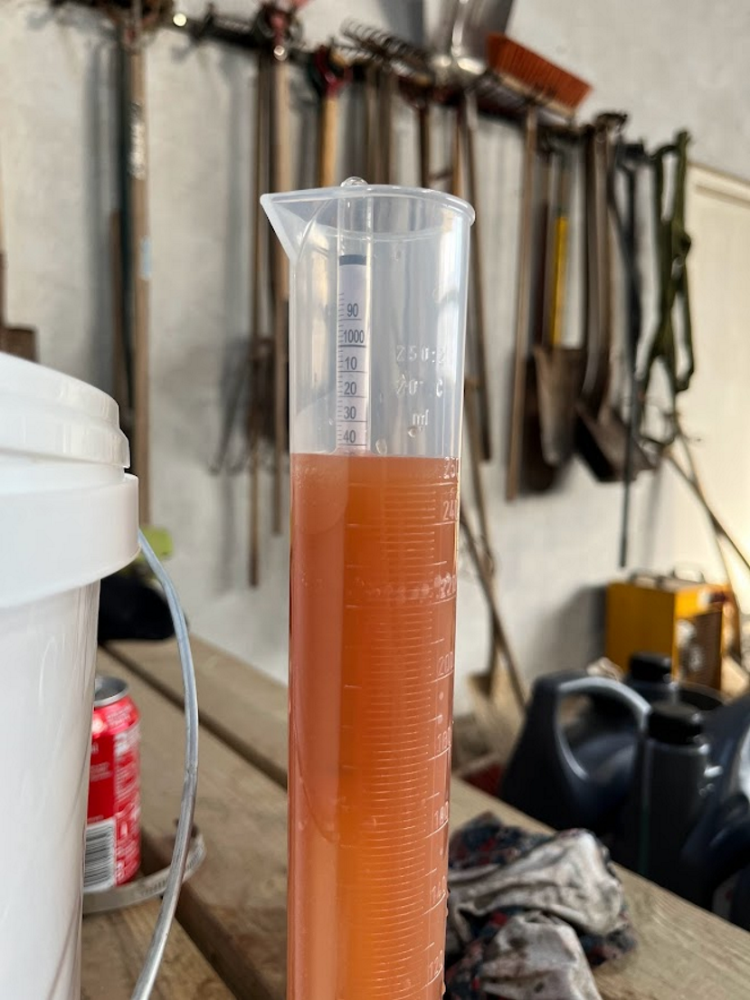
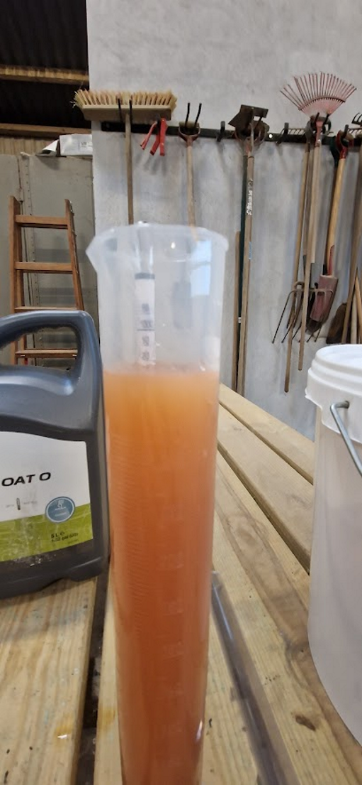

---
tags:
   - cider
---

# Æblecider
___

## Guide til at lave æble cider
___

1. **Indsamling af æbler og eftermodning**
Det bedste produkt kommer af de bedste råvare.
      - **Sammensæt med forskellige sorter **
Når der anvende flere sorter, så kan de forskellige sorter komplimentere hinanden. Det giver derfor god mening at benytte flere forskellige typer af æbler:

Et miks som dette kan give et godt resultat:
| Æbletype | Andel |
|---|---|
| Bittersøde æbler  | 30 % |
| Bittersure æbler | 30 % |
| Søde æbler | 30 % |
| Sure æbler | 30 % |
 	

- Æblet skal være moderne og klar**
En god æb**lecider bliver lavet af gode og modne æbler.

Det er derfor vigtigt at bruge æblerne når de er klar. Nogle sorter er dårlige i september med perfekte i november, det er derfor vigtigt at finde det rigtige tidspunkt at starte.

Til æblecider bruger vi gerne nedfaldsæbler. Disse æbler har en højere modenhed end de som stadig hænger på træet og dette er afgørende. 

Det er derfor fortrukket at indsamle nedfaldsæbler til ciderproduktionen.

- **Eftermodning af æblerne**
Æblerne skal have en høj modenhed før de er klar til cider. Det kan derfor give god mening at efter modne æblerne.

Eftermodning af æblerne vil medvirke til at stivelsen i æblet bliver omdannet til sukker, hvilket øger det overordnet sukkerindhold i mosten.

Eftermodning af æblerne bør ske i sække eller kasser på en kølig og ventileret lokation, hvor æblerne ikke bliver udsat for sol. Perioden æblerne skal eftermodne afhænger af æble sorten, æblets tilstand og vejret afgøre hvor længe de skal eftermodne, men et spænd omkring 1-4 uger kan ofte give mening.

Såfremt æblerne eftermodnes, så bør de inden da vaskes for jord og ligne. 

1. **Lav æblemosten**

- **Vaskning og kværning**
Æblerne starter med at blive vasket inden de bliver overført til en frugtkværn, som laver dem om til en findelt pulp.

- **Maceration**
Pulpen kan med fordel ligge i plastik kar i 8-24 timer. Dette vil få æblerne til at oxiderer, hvilket brunfarver pulpen og blødgøre taninen i æblerne, så cideren vil blive mere nuanceret.

- **Presning**
Hernæst presses pulpen, så den rene æblemost opnås.

1. **Klargøring til gæring**

- Tilpas mosten til at overholde følgende krav:

Ciderfremstilling efter den franske metode skal du bruge:
   - Ikke pasteuriseret most
   - Most uden nogen form for tilsætning
   - En oechsle måling på mindst 1055 (og gerne mere), hvilket svarer til et sukker indehold på 120g/L
   - En most med en Ph værdi mellem 3,2 - 3,8

- **Hæld mosten på beholdere**

Hæld dernæst mosten på fødevare godkendte beholdere med stor overflade
Tildæk overfladen med et klæde for at beskytte imod urenheder, eller lad det stå helt åbent. Luk ikke med låg.

4. **Gæring**

- **Dannelsen af hat**

Det ønskes at der dannes en hat på toppen af cideren. Pektinen af cideren vil samle sig i toppen og danne en hat. Dette får pektinen og kvælstoffet i selve mosten til at blive mindsket, hvilket er at foretrække. Dette går gæringen til at forløbe langsommere og derved bliver slut cideren mere kompleks og med restsødme.

**Hat dannelses:**

**Dag 1-5:**	Overfladen tætnes af mørke klumper pektin, der sammenkæder. Hatten kan også formeres som en geleblok, der står fra bund til top i din beholder
**Dag 5-8:**	Hatten vokser i volumen og overflade. Kan blive helt tæt og hæve op, og kan nøjes med at formatere som mindre øer. Mørknes.
**Dag 8-12:**	Små hvide skumdannelser opstår i overfladen, som er et tegn på, at gæringen er undervejs. Hatten løftes mod overfladen grundet Co2 udviklingen, og skal nu afskummes.

   - **Om stikning af mosten**

Når mosten af er klar skal den omstikkes til en ny beholder.

I toppen af mosten vil hatten være placeret, mens i bunden er der døde gærceller. Ved omstikningen er det derfor vigtigt at undgå at overføre disse to lag til den nye beholder.
   - **Kold gæring**

Efter at det er om stukket, så stilles beholderen til kold gæring. Dette skal ske med luftsikret beholdere gerne med en vandlås på. Beholderen stilles køligt ved en rumtemperatur på 8-12 grader.

1. **Flaskning**

      - **Hold øje med gæringen**
Efter gæringen er på begyndt, så skal den iagttages da det er oechsle, som afgøre hvornår cideren er klar til at blive flasket.

Cideren startede på omkring 1055, når den rammer 1030, så kan cideren sættes på flaske. Dette vil resultere i en halvsød/halvtør cider. Dog er det her vigtigt at få kulsyren ud af cideren inden den flaskes. Dette gøres ved at omstikke igen lige før den flaskes.

      - **Stabil cider**
En stabil cider der er klar til flaskning falder makimalt 2 oechsle på en periode af 14 dage. Samtidig så skal cideren var helt klar, så man kan se igennem den.

| Type | Betegnelse på fransk | Oechslemål / SG | Sukkerindhold |
|---|---|---|---|
| Tør | Brut natrual / Brut Zero | 999-1000 | 0-3 g/l |
| Tør | Extra Brut | 1000-1002 | 0-6 g/l |
| Tør | Brut | 1002-1005 | > 15 g/l |
| Halvtør/Halvsød | Extra sec / Extra Dry | 1005-1010 | 12-20 g/l |
| Sød | Sec | 1010-1014 | 17-35 g/l |
| Sød | Demi-Sec | 1014-1020 | 33-50 g/l |
| Sød | Doux | >1020 | >50 g/l |

## Logbog
___

### 2023 
___
*2023-09-16*
Vi påbegyndte æblecider produktionen på gården.

Æblerne vi brugte var de gamle mad æble tæt på pavelionen, de andre madæble ved siden af de søde Discovery æbler også Discovery æblerne.

Vi pressede pulpen med det samme og blandede mosten med cirka 50% madæble most og 50 % Discovery æblemost. Det gav en most med et Oechslemål på cirka 1045 og en Ph-værdi på cirka 3,2 - 3,3.

Vi hældte mosten direkte på gærspanden med låg og vandlås.
Vi satte dernæst spanden hen på Gesinggaard i vandrummet får at have en rumtemperatur på cirka 8-12 grader.

*2023-09-24*
Vi tog ud og kiggede på cideren, som stod inde i vandrummet og gærede.

Den havde en Oechslemål på cirka 1042. 
Vi smagte på den, og den smagte primært af æblemost dog havde den en lille smule brus på tungen.

*2023-10-01*
Jeg var ude og se på æblecideren igen. Den har ikke dannet nogen hat eller lignende. 
Jeg tog oechsl værdien, hvilket lå på 1022. Ph værdien lå på cirka 3,6.
Jeg er lidt bange for den, da smagen er blevet lidt acetone agtigt, så gæringen er muligvis gået galt.

*2023-10-10*
Cideren havde en  oechsl værdien på 1010.

Den havde en smag af acetone og lak. Jeg mistænker derfor at gæringen af gået galt.
Der lyder til at dette typisk sker når gæren har været stresset f.eks. Ved gæring ved høj temperatur. Det kan dog også være pga. vi har brugt vildgær..?

Cideren endte med at stå længe i gærspanden, men den begyndte at smage af acetone, hvorfor vi valgte a kassere den... :(

## Referencer
___

!!! info "Lignende opskrifter"
    - [Fransk ciderfremstilling](https://nordiskselvforsyning.dk/fransk-ciderfremstilling/)
    - [Din første cider](https://www.dr.dk/mad/opskrift/din-forste-cider)
    - [Non-fermentable sugar for cider](https://www.oculyze.net/when-to-add-non-fermentable-sugar-to-cider-and-why/)
    - [Non-fermentable sugar for hard cider](https://www.homecidermaking.com/non-fermentable-sugar-for-hard-cider/)