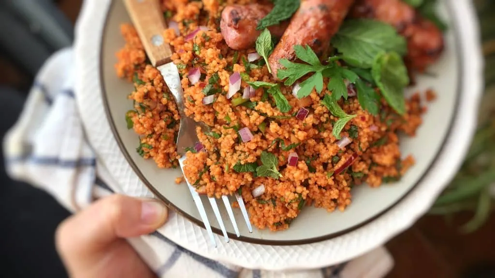

---
tags:
   - tyrkisk
---

# Couscous Tomat Salat

## Ingredienser (4 personer)
- 240 ml grøntsagsbouillon
- 2 spsk citronsaft
- 2 spsk tomatpuré
- 40 ml olivenolie
- En håndfuld frisk persille, hakket
- Salt og peber efter smag

## Sådan gør du

1. Tilbered couscous:
     - Bring grøntsagsbouillonen i kog. Overfør couscousen til en keramisk skål eller glasskål. Tilsæt den varme bouillon og rør rundt.
     s- Dæk skålen og lad den stå i 10 minutter, indtil bouillonen er fuldt absorberet.
2. Forbered tomatblandingen:
     - Når couscousen er kogt og mør, rør den med en gaffel for at løsne kornene. Varm olivenolien i en pande over medium varme, indtil den er varm. Tilsæt tomatpuréen.
     - Rør og steg tomatpuréen i 2 minutter. Tilsæt derefter den hakkede løg.
3. Bland ingredienserne:
     - Tag panden af varmen og lad den olierede tomatblanding køle af i ca. 5 minutter. Tilsæt den kogte couscous til panden. Krydr med salt og peber.
    - Rør godt rundt, indtil couscousen er jævnt rødfarvet. Tilsæt den hakkede persille og citronsaft.
4. Servering:
     - Rør godt rundt igen. Smag til og tilsæt ekstra salt, peber eller citronsaft efter behov. Overfør tomatcouscousen til en serveringsskål. Server lun eller ved stuetemperatur.

!!! info "Lignende opskrifter"
    - [junedarville - couscous-salad-recipe](https://www.junedarville.com/couscous-salad-recipe.html)