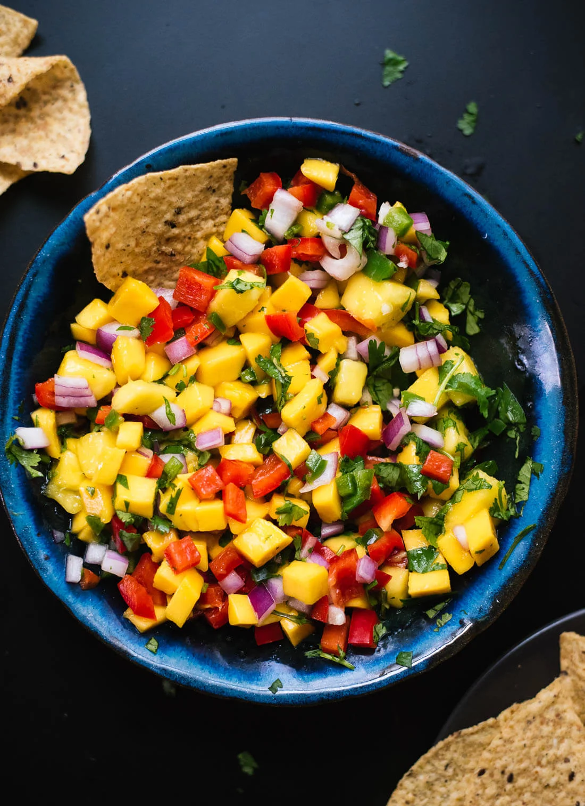

---
tags:
   - mexikansk
---

# Mango salsa

## Ingredienser (4 personer)
- 3 modne mangoer, skåret i tern
- 1 mellemstor rød peberfrugt, hakket
- 1 dl hakket rød løg
- 0,5 dl friske korianderblade, hakket
- 1 jalapeño, uden frø og finthakket
- Saften fra 1 stor lime (ca. 0,5 dl limesaft)
- ⅛ til ¼ teskefuld salt, efter smag

## Sådan gør du
1. I en serveringsskål kombineres den forberedte mango, peberfrugt, løg, koriander og jalapeño. Dryp med saften fra en lime.
2. Brug en stor ske til at røre ingredienserne sammen. Smag til med salt, og rør igen. For den bedste smag, lad salsaen hvile i 10 minutter eller længere.

## Referencer

!!! info "Lignende opskrifter"
    - [Frisk mango salsa opskrift](https://cookieandkate.com/fresh-mango-salsa-recipe/)