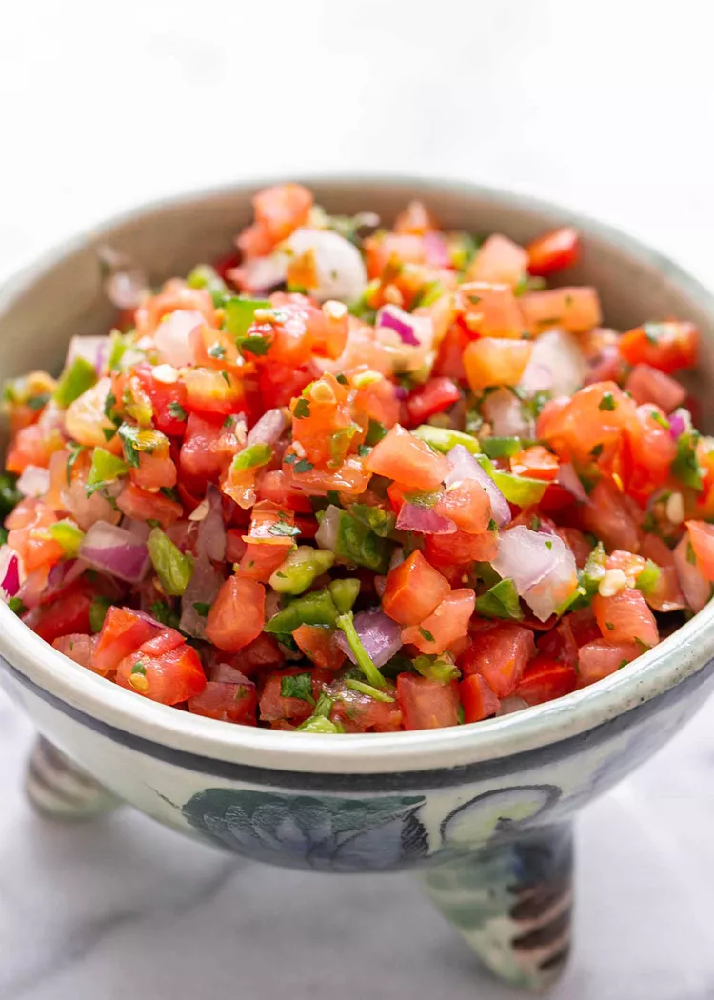

---
tags:
   - mexicansk
---

# Pico de Gallo

## Ingredienser (4 personer)

- 4 mellemstore tomater, hakket
- 1/2 mellemstor løg, finthakket
- 1-2 jalapeño chilier, frø fjernet og finthakket
- 1/4 kop frisk koriander, hakket
- 2 spsk. frisk limesaft
- Salt og peber efter smag

## Sådan gør du

1. **Forbered ingredienserne:**
     - Placer alle ingredienserne i skålen af en foodprocessor udstyret med en kniv. Pulse kun et par gange, lige nok til at finhakke ingredienserne og ikke nok til at purere dem. Hvis du ikke har en foodprocessor, kan du finhakke ingredienserne i hånden.
2. **Juster krydderierne:**
     - Placer i en serveringsskål. Tilsæt salt og peber efter smag. Hvis chilierne gør salsaen for stærk, tilsæt nogle flere hakkede tomater. Hvis den ikke er stærk nok, tilsæt forsigtigt nogle af frøene fra chilierne, eller tilsæt lidt mere stødt spidskommen.
3. **Lad smagene kombinere:**
     - Hvis du ønsker det, lad salsaen stå i en time (stuetemperatur eller kølet) for at smagene kan kombinere.
4. **Servering:**
     - Server med chips, tortillas, tacos, burritos, tostadas, quesadillas, eller pinto bønner, eller sorte bønner. Salsaen kan opbevares i køleskabet i op til 5 dage.

## Tips

- For en mildere version, fjern frøene fra jalapeño chilierne.
- Du kan tilføje lidt hakket avocado for en cremet tekstur.

## Servering

Server din Pico de Gallo med:
- Tortilla chips
- Tacos
- Burritos
- Quesadillas
- Som topping til grillede kødretter

!!! info "Lignende opskrifter"
    - [Simply Recipes - Pico de Gallo](https://www.simplyrecipes.com/recipes/fresh_tomato_salsa/)