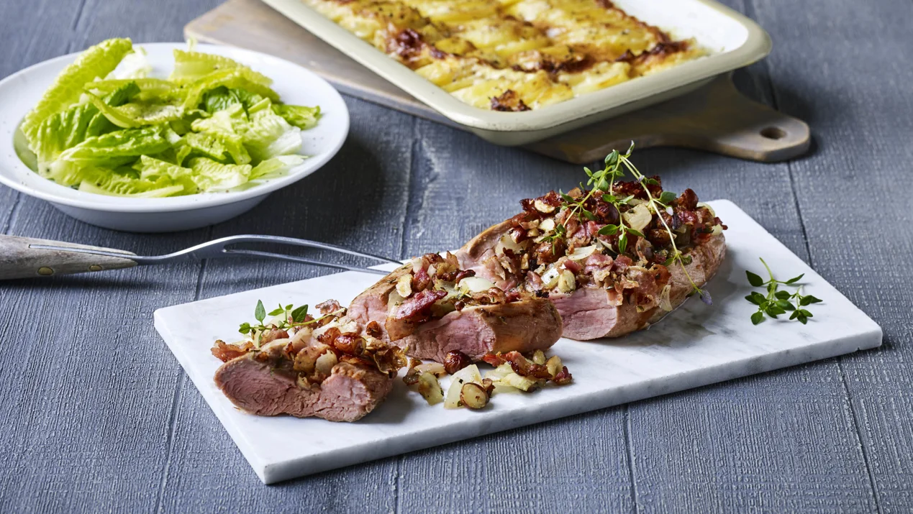

---
tags:
   - dansk
---

# Svinemørbrad med hasselnødder

## Ingredienser (4 personer)
- 25 g smør
- 1 afpudset svinemørbrad (ca. 475 g)
- ½ tsk groft salt
- 125 g bacon i skiver
- 2 grofthakkede løg (ca. 150 g)
- 50 g hakkede hasselnøddekerner
- 1 lille finthakket fed hvidløg
- 2 spsk frisk timian
- ½ tsk groft salt

## Sådan gør du

1. Lad smørret blive gyldent i en pande. Brun svinemørbraden på alle sider ved jævn til kraftig varme i ca. 4 min. i alt.
2. Tag mørbraden op og skær en rids, ca. 2 cm dyb, ned midt i mørbraden - bred den ud til siderne og drys med salt. Læg mørbraden i et ovnfast fad.
3. Skær baconen i små strimler og steg dem ved kraftig varme og under omrøring i panden i ca. 2 min. Tilsæt løg, hasselnødder, hvidløg, timian og salt og steg i yderligere ca. 2 min.
4. Kom baconblandingen i ridsen i mørbraden og sæt stegen øverst i ovnen i ca. 15 min. ved 175° - varmluft.

## Tips
- Du kan tilføje små stykker grøntsager (f.eks. peberfrugt eller løg) for ekstra farve og smag.

## Servering
Server din svinemørbrad med:
- Fladbrød eller pita
- Hummus, tzatziki, baba ganoush, yoghurt dressing
- Grøn salat eller tabbouleh
- Grillede grøntsager (f.eks. peberfrugt, squash eller aubergine)
- Syltede grøntsager (f.eks. syltede rødløg eller agurker)

## Erfaringer

!!! note "Husk at dræne auberginen"
    Det er vigtigt at dræne auberginen, hvis man ønsker en fast baba ganoush

## Referencer

!!! info "Lignende opskrifter"
    - [Svinemørbrad i ovn](https://www.arla.dk/opskrifter/svinemorbrad-i-ovn/)