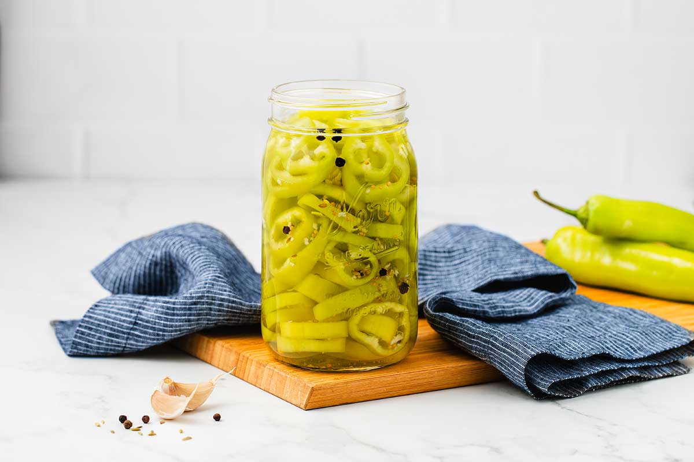

---
tags:
   - syltning
---

# Syltet banan chili

## Ingredienser
- 10 bananpeber
- 4,7 dl hvid eddike (5%)
- 2,4 dl vand
- 1 spsk rent salt (kosher, syltesalt, havsalt)
- 1/2 spsk sukker (valgfrit, men anbefales)
- 1 tsk sennepsfrø
- 1 tsk sorte peberkorn
- 1/2 tsk sellerifrø
- 3 fed hvidløg, knust

## Sådan gør du
1. Steriliser dine glas ved at koge dem i 10 minutter (uden låg).
2. Rens og inspicer dine bananpeber. Rul dem forsigtigt på et skærebræt for at løsne frøene. Skær toppen af bananpeberne og brug en spisepind til at fjerne frøene.
3. Skær dine bananpeber i skiver på 0,6 cm til 1,3 cm. Fyld dine steriliserede glas med peberne.
4. Forbered din lage ved at bringe eddike, vand, hvidløg, sukker, salt og krydderier i kog. Fjern lagen fra varmen, når den koger.
5. Hæld forsigtigt den varme lage i glasset med peberne. Brug et papirhåndklæde dyppet i eddike til at tørre rundt om glaskanten og rense eventuelt spild.
6. Forsegl glassene og lad dem køle af, før de sættes i køleskabet. Lad dem trække i et par dage, før du spiser dem. Disse er køleskabssyltede og bør spises inden for en måned.

## Referencer

!!! info "Lignende opskrifter"
    - [Peppergeek - Pickled banana peppers](https://peppergeek.com/pickled-banana-peppers/)