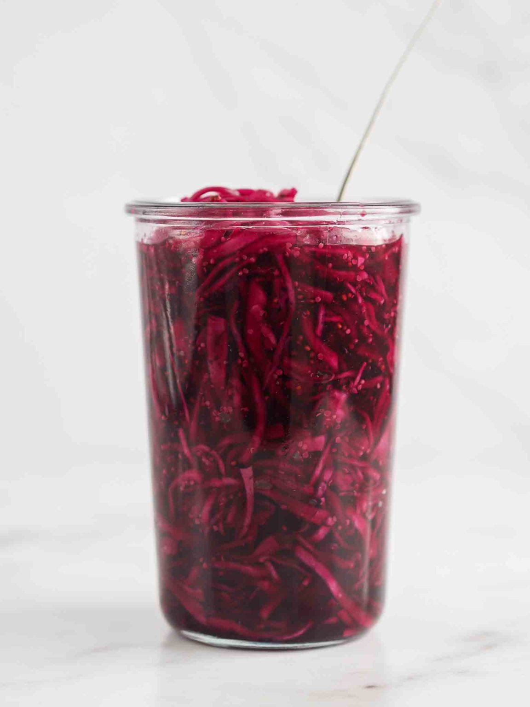

---
tags:
   - tyrkisk
---

# Syltet Rødkål

## Ingredienser (4 personer)

- 1 rødkålshoved, skåret i tynde skiver
- 1 tsk. friskkværnet peber
- 1 ½ spsk. salt
- 300 ml æblecidereddike
- 300 ml vand
- 200 g sukker
- 2 spsk. grov sennep

## Sådan gør du

1. **Forbered rødkålen:**
   - Skær rødkålen i tynde skiver og hak dem i mindre stykker. Læg kålen i en stor skål, og drys med salt og friskkværnet peber. Masser det med hænderne i et par minutter.
   - Læg nu rødkålen i et sylteglas, der kan lukkes tæt. Det skal kunne indeholde 1500 ml.
2. **Lav syltelagen:**
   - Hæld æblecidereddike, sukker, vand og sennep i en gryde og bring det i kog.
3. **Sylt rødkålen:**
   - Hæld den varme syltelage i glasset. Lad det køle i 5 minutter og sæt låg på og kom på køl.
4. **Lad rødkålen trække:**
   - Lad rødkålen trække en dag inden den tages i brug. Det bliver faktisk bare bedre og bedre af at stå nogle dage.

## Tips

## Servering

## Erfaringer

## Referencer

!!! info "Lignende opskrifter"
    - [beetrootbakery - syltet-rødlåk-med-sennep](https://www.beetrootbakery.dk/syltet-rodkal-med-sennep/)