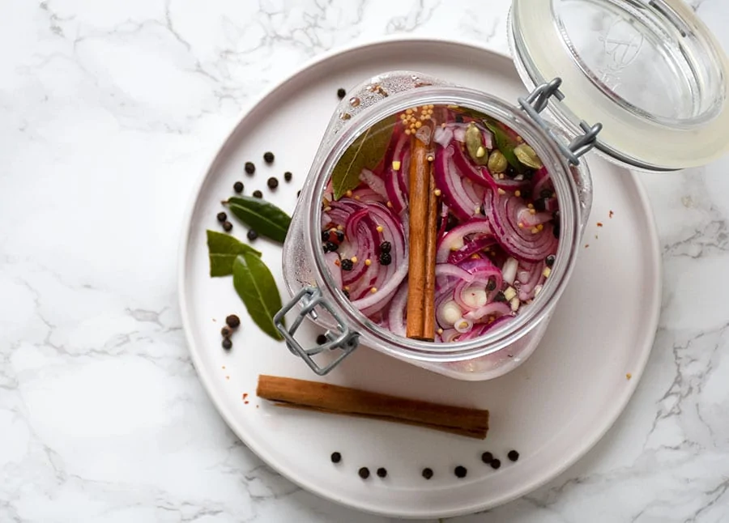

---
tags:
   - syltning
---

# Syltede Rødløg

## Ingredienser (8 personer)
- 4 rødløg
- 1 dl vand
- 1 dl sukker
- 1 dl eddike
- 1 tsk peberkorn

## Sådan gør du

1. Forbered løgene:
   - Skær løgene i tynde ringe og kom dem i et rent skoldet patentglas.
2. Lav eddikeblandingen:
   - Kog eddike, vand og sukker op i en gryde sammen med peberkorn og eventuelt krydderier til sukkerkornene er smeltet.
3. Sylt løgene:
   - Hæld den kogende varme eddikeblanding over løgene, luk glasset og opbevar køligt.

## Tips
- Krydderierne til opskriften kan fx være: dild, kanelstænger, laurbærblade, kardemommefrø, nelliker.
- Hvor sød/sur de syltede rødløg skal være er en smagssag og som med al anden mad man laver skal man smage godt til. Jeg kan lide, de er syrlige. Synes du dine syltede rødløg er blevet for syrlige, så rør 1 dl sukker ud i 1 dl kogende vand og brug dette til at smage til med, til smagen er som du ønsker det.
- Æblecidereddike kan varieres med klar lagereddike, eller med en blanding af eddike og kogende vand. Det er der nogen der foretrækker, fx 2 dl eddike, 2 dl kogende vand og 1 dl sukker. Så bliver det også mindre syrligt uden der skal bruges mere sukker.
- Til du gerne have blødere løg med det samme, så kom løgene i gryden og lad den simre i 15 sekunder før de hældes på glas.
- Løgene kan spises efter et par timer og kan ellers holde sig i nogle uger

## Holdbarhed
- Syltede rødløg kan holde sig i op til 4 uger, hvis de opbevares køligt og i en lufttæt beholder.

!!! info "Lignende opskrifter"
    - [valdemarsro - syltede-rodlog](https://www.valdemarsro.dk/syltede-rodlog/)