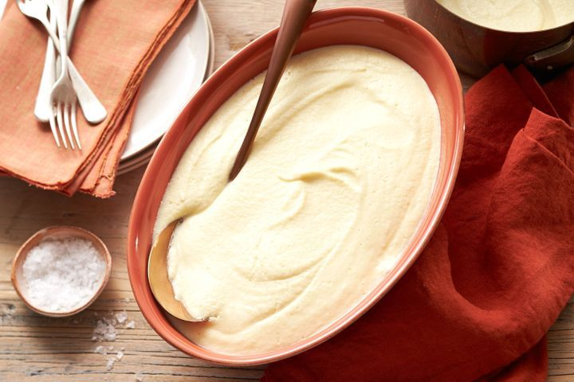

---
tags:
   - fransk
---

# Selleri Puré

## Ingredienser (6 personer)

- 1.5 kg knoldselleri, skrællet og skåret i 2 cm tern (ca. 1.2 kg)
- 750 ml mælk
- 300 ml fløde
- 100 g skalotteløg, grofthakket
- 40 g smør
- 1 1/2 tsk fint havsalt

## Sådan gør du

1. **Forbered ingredienserne:**
   - I en stor, tung gryde kombineres knoldselleri, mælk, fløde, skalotteløg, smør og salt, og bringes til en let simren over medium varme.
2. **Kog sellerien:**
   - Reducer varmen til lav og lad det simre meget forsigtigt, uden låg, under omrøring lejlighedsvis, i 35 minutter eller indtil knoldsellerien er mør nok til at moses med en ske.
3. **Blend puréen:**
   - Arbejd i portioner og brug en hulske til at overføre knoldselleri og skalotteløg til en blender (helst en kraftig en). Blend indtil glat, tilsæt nok af kogevæsken til at danne en meget tyk, cremet og helt glat puré. Overfør til en serveringsskål.

## Tips

- For en ekstra cremet tekstur, kan du sigte puréen gennem en finmasket si efter blending.
- Du kan tilføje lidt hvid peber for ekstra smag.

## Servering

Server din selleri puré med:
- Stegt kød
- Fisk
- Grøntsager

## Erfaringer

!!! note "Husk at smage til"
    Det er vigtigt at smage puréen til med salt og peber efter blending for at sikre den rette smag.

## Referencer

!!! info "Lignende opskrifter"
    - [Simply Recipes - Celery Root Puree](https://www.simplyrecipes.com/recipes/celery_root_puree/)